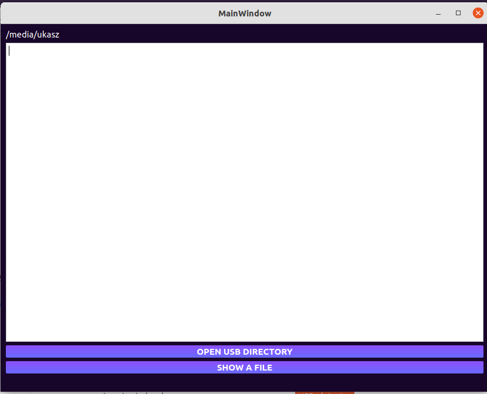

# USB detector
This is a simple application for reading files from your USB.  
It was tested on Ubuntu 21.10.

## How to use
To use this application you have to clone the whole reposiotry and then just run: /build-USB_detector-Desktop_Qt_6_2_4_GCC_64bit-Debug/USB_detector.  

After running it such a window should appear:
  

### Usage is pretty simple, we just have two buttons:
1) __OPEN USB DIRECTORY__ - this button opens our default file manager starting from USB direcotry (on Ubuntu it will be Nautilus), and then we have to simply choose file which we want to read.
2) __SHOW A FILE__ - this button load our choosen file to our window (path to this file pops up on the top of our app window). 

#### After loading first file we can choose to read another one.  

#### If we want to close the app, we can simply close our window by pressing 'x' on the top-right corner or press ESC button.

### Note
If we insert USB after running application, file manager window will pop up automatically, due to fact that app will automatically detect USB.
